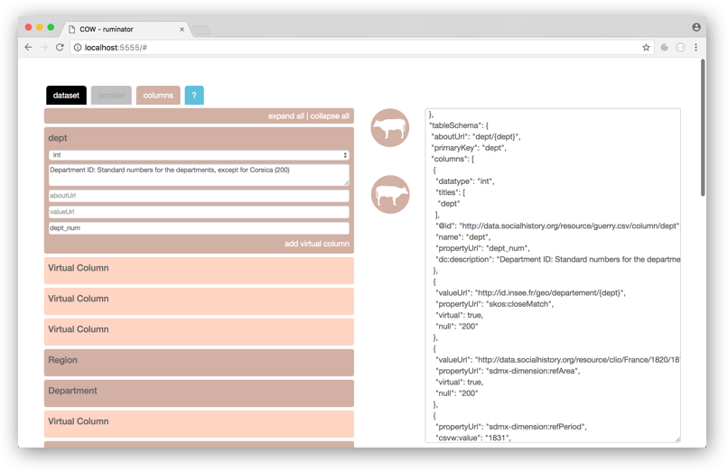

# ruminator

Ruminator is a GUI in which to edit JSON schemas produced by [COW](http://csvw-converter.readthedocs.io/en/latest/#). On the right, paste a JSON schema and press the top COW-button to populate the Ruminator-form. Edit the form and press the second COW-button to write your edits to the JSON schema.

## installation

1. git clone or download this repository to a directory
2. open directory in a browser
